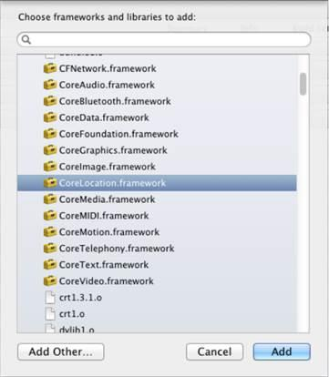
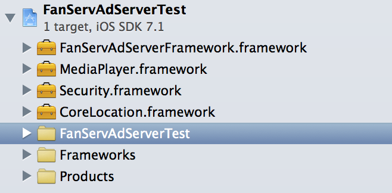
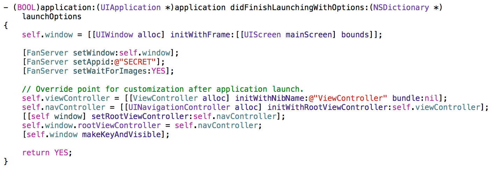
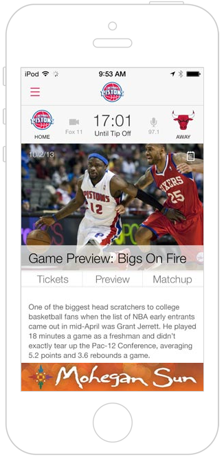
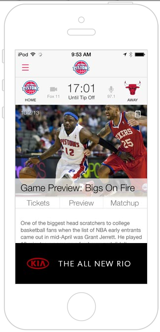
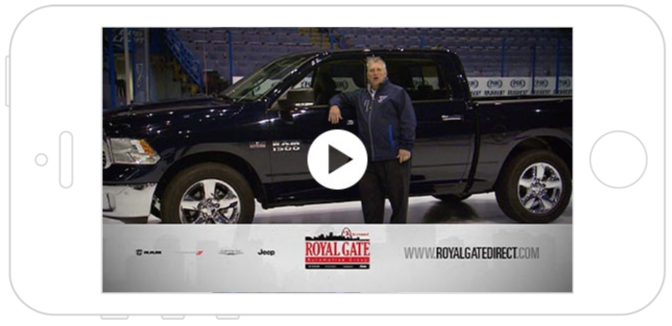

# FanServer iOS SDK Integration

### Integration Guidelines

1. Set Up
  * Required Frameworks
  * Adding External Resource
  * Project Complete
2. Configuration
  * Required Framework Configuration Settings
  * Optional Framework Configuration Settings
3. Configuration Tip: Adding Header Information
    
### Customizing FanServer

1. Set Ad Type
    1. Banner
    2. Intertitial
    3. Expandable Banner
    4. Video Pre-Roll
2. Hide Ads on Screen
3. Enable or Disable Ads on Screen
4. Specify Screen Names
5. Close Banner Ads
6. Show Ads When They Finish Downloading
7. Set Video Pre-Roll Before Playing Audio
    
### FanServer Filters

1. By Age
2. By Gender
3. By Location

### Advanced Methods and Properties

1. Delegate Methods

## Integration Guidelines

### 1. Setup

Set up FanServer 1.0.1 by adding `FanServerFramework.framework` to the required frameworks:

* `CoreLocation.framework`
* `MediaPlayer.framework`
* `Security.framework`

Follow these next three (3) steps to add `FanServer.framework` to your project:

**Required Frameworks**

To find the required frameworks:

1. Go to your project settings
2. Then go to Build Phases
3. Link Binary With Libraries
4. Click "+" to add new framework
5. Find required frameworks and add to the project

You should see a screen similar to this:



**Adding External Resource**

`FanServerFramework.framework` is an external resource and can be added by clicking "Add Other" and locating path to the `FanServerFramework.framework` library.  You'll need to repeat this process, until you have finished adding the FanServer.framework to all of our required frameworks listed above.  

**Project Complete**

When complete your project should have a similar view as the image below:



### 2. Configuration

Configuring the settings provides you an opportunity to customize your application to receive and display ads.  Once the "Required Framework Configuration Settings" have been made in AppDelegate, you should start to see your first ads.  For greater controls over where ads are served on screen, on what screens, at what sizes, etc., you have ability to set the "Optional Framework Configuration Settings" and explore the individual controls in the "Customizing the Configuration of the FanServ SDK" sections.

**Required Framework Configuration Settings**

In AppDelegate, configure settings for FanServer by editing default behavior of framework:



*1. Set Main Window for Ads*

Method required to set main window of your application, please be sure that this method will be used when main window of your application is created, in other case you could crash your application.

eg. `[FanServer setWindow: [appDelegate window]];`

```csharp
+ (void) setWindow: (UIWindow *) w;
```

*2. Set Values for AppID Argument as String*

Next required method which identifies your application and provides appropriate context on the admin side.

eg. `[FanServer setAppid: @"YOUR_ID"];`

```csharp
+ (void) setAppid:(NSString *)appId;
```

*3. Set Ad Type, Screen Size and Device Type*

The framework remembers your most recent choice of values for font type, screen size and device type. If you don't set these parameters for each screen, the next ad will use the same information as the previous one.

eg. `[FanServer setAdType: FanServerAdTypeBanner size: @"320x50" deviceType: FanServerDeviceTypeMobile];`

available ad types:

```csharp
typedef enum{
    FanServerAdTypeInterstitial = 1,
    FanServerAdTypeBanner,
    FanServerAdTypeLeaderboard,
    FanServerAdTypeSkyscraper,
    FanServerAdTypeExpandable,
    FanServerAdTypePopup
} FanServerAdType;
```

**List of Available Ad Types**

available ad types

typedef enum{

    FanServerAdTypeInterstitial = 1,

    FanServerAdTypeBanner,

    FanServerAdTypeLeaderboard,

    FanServerAdTypeSkyscraper,

    FanServerAdTypeExpandable,

    FanServerAdTypePopup

} FanServerAdType;

### List of Available Device Types

typedef enum{

    FanServerDeviceTypeMobile = 1,

    FanServerDeviceTypeTablet,

    FanServerDeviceTypeWeb

} FanServerDeviceType;

**Optional Framework Configuration Settings**

In AppDelegate, configure settings for FanServer by editing default behavior of framework:

- (BOOL)application:(UIApplication *)application didFinishLaunchingWithOptions:(NSDictionary *)launchOptions

{

	...

	[FanServer setRotateBannerInLandscape:NO];

	[FanServer setWaitForImages:YES];

	[FanServer setAnimationStyle:FanServerAdAnimationFade];

}

### Configuration Tip:  Adding Header Information

When you want to add a header for a screen, add this to your project:

 #import <FanServerFramework/FanServer.h> 

If you add "ProjectName"-Prefix.pch, you don't have to add this import to each header file that uses the **FanServerFramework**.

**Configuration Tip:  Preload Ads for Specific ****Device ****Type and ****Banner ****Size**

When you want to be sure that ad will be displayed since first time or you want to have control when ads should be downloaded use method to preload ads before they should be displayed

eg. [FanServer preloadAds: FanServerAdTypeBanner size: @"320x50" deviceType: FanServerDeviceTypeMobile];

 available device types

typedef enum{

    FanServerDeviceTypeMobile = 1,

    FanServerDeviceTypeTablet,

    FanServerDeviceTypeWeb

} FanServerDeviceType;

+ (void) preloadAds:(FanServerAdType)type size:(NSString *)size deviceType:(FanServerDeviceType) deviceType;

### Customizing FanServer

### Customizing the Configuration of the FanServer SDK

These settings give you more control of how ads are displayed.  If you do nothing the ads will be loaded and displayed with default behaviors set in the Required and Optional Framework Configuration Settings sections.

### Set Ad Type

This is how to to set ad types and sizes

**+ setAdType:(FanServerAdType) adType size:(NSString *)size deviceType:(FanServerDeviceType) deviceType;**

Call **[FanServer setAdType:FanServerAdType size:@"size" deviceType:FanServerDeviceType];** in function **viewWillAppear**

- (void) viewWillAppear:(BOOL) animated

{

    [FanServer setAdType:FanServerAdTypeBanner size:@"320x50" deviceType:FanServerDeviceTypeMobile];

    [super viewWillAppear:animated];

}

### Specify Screen Name

By specifying a name for all screens that show ads, you improve the tracking and reporting capabilities of FanServer and will allow for reports to be run at a screen level.  So in the sample below, we would then be able to see how ads for "MainWindow" performed in aggregate on your application.  If you don't set one, the software will set a default name to **ClassName** for each specific screen and reports will only be aggregate at the application level.  

**+ setScreenName:(NSString* ) screenName;**

**[FanServer setScreenName:@"MainWindow"];**

Set this property in** viewWillAppea**r, as the following example shows:

(void) viewWillAppear:(BOOL) animated

{

    [FanServer setScreenName:@"MainWindow"];

    [super viewWillAppear:animated];

}

**Show Ad on a Specific Screen**

Use this method when you want to display an ad programatically.You can use different parameters to set ad position, type and size as well as device type, orientation and screen name. 

For example,

+ (void) showBannerAd:(UIViewController*) adViewController size:(NSString *)adSize forView:(UIView *)view x:(int)x y:(int)y screenName: (NSString*) screenName;

And

+ (void) showAd:(UIViewController*)adViewController x:(int)x y:(int)y adType:(FanServerAdType) type size:(NSString *)adSize deviceType:(FanServerDeviceType)deviceType orientation:(UIImageOrientation) orientation screenName: (NSString*) screenName;

### Hide Ads on Screen

For screens in which no ads are displayed,  set the** isAdVisible** value to NO.

- (void) viewWillAppear:(BOOL) animated

{

    [FanServer setIsAdVisible:NO];

    [super viewWillAppear:animated];

}

**Configuration Tip: ** Remember to call [super viewWillAppear:animated].

### Enable or Disable Ad on Current Screen

### eg. [FanServer setIsAdVisible: NO];

### + (void) setIsAdVisible: (BOOL) isVisible;

### Configuration Tip:  The difference between Hiding Ads on Screen and Enabling Ads on Current Screen

	+ (void) setShowAdOnLoad:(BOOL)c;

### Change Default to Show Ads Manuualy or Automatically

You can decide whether to show ads automatically when the screen appears.

* When you set the property to NO, you can show an ad manually by using a **showAd** method. However for each **UIViewController **you want to display the ad automatically, you must set the ad property to YES, as example below.

	[FanServer setIsAdVisible: YES];

* When you change the property to YES, you have to set [FanServer setIsAdVisible: NO]; for each **UIViewController** that you don't want to show the ad automatically. 

	[FanServer setIsAdVisible: NO];

	eg. [FanServer setShowAdOnLoad:NO];

### 
Close Banner Ads

When you scroll or go back to a previous screen, banner ads will be closed automatically after a few seconds.

But when you change settings in **viewWillDisappear**, remember to call **[super viewWillDisappear:animated]; **to ensure that ad was correctly closed.** **

### Show Ads When They Finish Downloading

When you want to display an ad, but assets have not finised downloading, there are two ways to go:

* To make sure that ads do not appear,use** setWaitForImages:NO** 

* To display the ad when the download is finished, use** setWaitForImages:YES** -  

eg. [FanServer setWaitForImages:YES];

+ (void) setWaitForImages: (BOOL) wait;

**Enable or Disable Rotating Banner Ad **

When the device displays ads in landscape, use this method to turn the ad on or off.

eg. [FanServer setRotateBannerInLandscape: YES];

+ (void) setRotateBannerInLandscape: (BOOL) rotate;

### Configure Animation Style

Developer could choose one of styles that we've created in SDK for displaying ads. He can't define his own style.  So he can choose if ad should enter to the main screen from left, right, top, bottom or fade (change alpha from 0 to 1)

 eg. [FanServer setAnimationStyle: FanServerAdAnimationFade];

 available animation styles:

typedef enum{

    FanServerAdAnimationFromLeft = 1,

    FanServerAdAnimationFromRight,

    FanServerAdAnimationFromTop,

    FanServerAdAnimationFromBottom,

    FanServerAdAnimationFade

} FanServerAdAnimationOptions;

+ (void) setAnimationStyle: (FanServerAdAnimationOptions) style;

### Set Video Pre-Roll Before Playing Audio

Use this procedure when you want to play a  video preroll before the audio begins.

- (void) viewWillAppear:(BOOL) animated

{

    [FanServer setAudioPlaying:YES];

    [super viewWillAppear:animated];

}

**FanServer Filters**

You have opportunities to target your ads for specified group or locations.

### Enable Device to Get Location

You have ability to display ads for a specific location or region, just allow to get user location and set properly your settings.

 eg. [FanServer allowGetLocation:YES];

+ (void) allowGetLocation: (BOOL) choice;

### Filter Ads by Age

You can filter ads by age and display different for users who are adult or kids.

eg. [FanServer setAge: 20];

+ (void) setAge: (int) age;

### Filter Ads by Gender

You have ability to display ads depending on the user gender, just provide their gender to the method described below.

typedef enum{

    FanServerAdFemale = 1,

    FanServerAdMale,

    FanServerAdAny

} FanServerAdGender;

+ (void) setGender: (FanServerAdGender) gender;

## Advanced Methods and Properties

**Delegate Methods**

Use **setAdsDelegate** to deal with certain situations such as making a banner appear,closing a banner and tapping an ad. 

+ (void) setAdsDelegate:(id<FanServerAdsDelegate>)delegate;

Use methods from the following list:

@protocol FanServerAdsDelegate <NSObject>

@optional

- (void) fanServerBannerDidAppear;

- (void) fanServerBannerDidClose;

- (void) fanServerInterstitialDidAppear;

- (void) fanServerInterstitialDidClose;

- (void) fanServerAdDidFail;

- (void) fanServerPopupDidAppear;

- (void) fanServerPopupDidClose;

- (void) fanServerRequestDidFail;

- (void) fanServerAdTapped;

- (void) fanServerDidBackFromAdView;

@end


**Examples:**

**[INTERSTITIA**L](http://fanserv.scottarnold.org/advertisers/#)

**Standard / Retina**

**300x250 / 600x500**


**[BANNE**R](http://fanserv.scottarnold.org/advertisers/#)

**Standard / Retina**

**320x50 / 640x50**



**[EXPANDABL**E](http://fanserv.scottarnold.org/advertisers/#)

**Standard / Retina**

**320x50 / 640x50**



**[VIDE**O](http://fanserv.scottarnold.org/advertisers/#)

**Standard / Retina**

**320x480 / 640x960**



